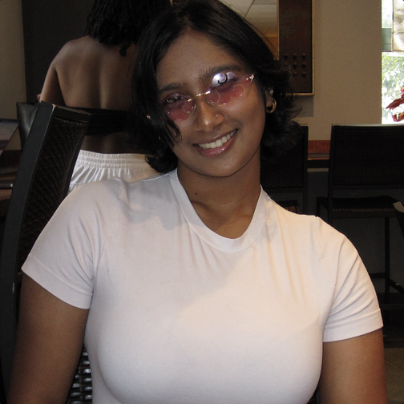

# 🚀 Winrock International Repository 🚀

Welcome to the Winrock International/Hack4Impact-UMD repository! This is where we will be committing all our code throughout the semester. Please make sure to go through the table of contents and complete the project set up. Also note that PR Instructions is MANDATORY to read through - we need all engineers to follow this to ensure efficient code review. As always, please let us know if you have any questions!

## 📚 Table of Contents
1️⃣ [Meet the Team](#meet-the-team)

2️⃣ [Project Set Up](#%EF%B8%8F-project-set-up)

3️⃣ [System Design](#-system-design)

4️⃣ [PR Instructions](#-pr-logistics)

5️⃣ [Miscellaneous](#%EF%B8%8F-miscellaneous)

---
###  Meet the Team 

<p align="center">
  
</p>

This is the team working on Winrock! We're a crew of problem-solvers, designers, and builders, and we're excited to be working on this project together in a collaboration with Winrock and Hack4Impact-UMD.

<table align="center">
  <tr>
    <td align="center" width="150">
      <a href="https://www.linkedin.com/in/faith-comising/">
        <br/>
        <b>Faith Comising</b><br/><br/>
        
      </a>
    </td>
    <td align="center" width="150">
      <a href="https://www.linkedin.com/in/suhani-agrawal-90502a225/">
        <br/>
        <b>Suhani Agrawal</b><br/><br/>
        
      </a>
    </td>
  </tr>
</table>


<table align="center">
  <tr>
    <td align="center" height="150" width="150">
      <a href="https://www.linkedin.com/in/hita-thota/">
        <br/>
        <b>Hita Thota</b><br/><br/>
        
      </a>
    </td>
    <td align="center" height="150" width="150">
      <a href="https://www.linkedin.com/in/debarshi-dey/">
        <br/>
        <b>Debarshi Dey</b><br/><br/>
        
      </a>
    </td>
  </tr>
</table>

<table align="center">
  <tr>
    <td align="center" width="150">
      <a href="https://umd.hack4impact.org/">
        <br/>
        <b>Nynika Badam</b><br/><br/>
        
      </a>
    </td>
    <td align="center" width="150">
      <a href="https://umd.hack4impact.org/">
        <br/>
        <b style="font-size: 0.3em;">Samundara Srinivas</b>
        
      </a>
    </td>
    <td align="center" width="150">
      <a href="https://umd.hack4impact.org/">
        <br/>
        <b>Indira Shafii</b><br/><br/>
        
      </a>
    </td>
  </tr>
</table>


<table align="center">
  <tr>
    <td align="center" width="150">
      <a href="https://umd.hack4impact.org/">
        <br/>
        <b style="font-size: 10px;">Aakash Kalmady</b>
        
      </a>
    </td>
    <td align="center" width="150">
      <a href="https://umd.hack4impact.org/">
        <br/>
        <b>Indra Pabba</b><br/><br/>
        
      </a>
    </td>
    <td align="center" width="150">
      <a href="https://umd.hack4impact.org/">
        <br/>
        <b>Jai Patel</b><br/><br/>
        
      </a>
    </td>
    <td align="center" width="150">
      <a href="https://umd.hack4impact.org/">
        <br/>
        <b>Leia Spagnola</b><br/><br/>
        
      </a>
    </td>
  </tr>
  <tr>
    <td colspan="4" align="center">
        <table align="center">
          <tr>
            <td align="center" width="150">
                <a href="https://umd.hack4impact.org/">
                <br/>
                <b style="font-size: 10px;">Nadia Meyerovich</b>
                
                </a>
            </td>
            <td align="center" width="150">
                <a href="https://umd.hack4impact.org/">
                <br/>
                <b>Rishi Agarwal</b><br/><br/>
                
                </a>
            </td>
            <td align="center" width="150">
                <a href="https://umd.hack4impact.org/">
                <br/>
                <b>Srinidhi Gubba</b><br/><br/>
                
                </a>
            </td>
          </tr>
        </table>
    </td>
  </tr>
</table>
<table align="center">
  <tr>
    <td align="center" width="150">
      <a href="https://umd.hack4impact.org/">
        <br/>
        <b>Brian McAbee</b><br/><br/>
        
      </a>
    </td>
    <td align="center" width="150">
      <a href="https://umd.hack4impact.org/">
        <br/>
        <b>Laura Mills</b><br/><br/>
        
      </a>
    </td>
  </tr>
</table>

#### 🌟 Our Alumni

<table align="center">
  <tr>
    <td align="center" width="150">
      <a href="https://umd.hack4impact.org/">
        <br/>
        <b>Kalpana Iyer</b><br/><br/>
        
      </a>
    </td>
    <td align="center" width="150">
      <a href="https://umd.hack4impact.org/">
        <br/>
        <b>Om Arya</b><br/><br/>
        
      </a>
    </td>
      <td align="center" width="150">
      <a href="https://umd.hack4impact.org/">
        <br/>
        <b style="font-size: 0.3em;">Kaavya Radhakrishnan</b>
        
      </a>
    </td>
   <td align="center" width="150">
      <a href="https://umd.hack4impact.org/">
        <br/>
        <b>Arjun Mahendra</b><br/><br/>
        
      </a>
   </td>
   <td align="center" width="150">
      <a href="https://umd.hack4impact.org/">
        <br/>
        <b>Kyle Cho</b><br/><br/>
        
      </a>
   </td>
   

  </tr>
</table>

---

### 🛠️ Project Set Up
This section is important, so make sure to go through these steps to ensure your set up is correct. Reach out to Tech Leads should there be any issues that arise.
#### 🌐 Folder/Directory Set Up
1. Ensure you have SSH key set up completed (documentation for this can be found [here](https://docs.github.com/en/authentication/connecting-to-github-with-ssh/generating-a-new-ssh-key-and-adding-it-to-the-ssh-agent)).
2. On the Github page, get the SSH clone link (referred to as SSH URL)
3. Cd into a folder on your system that will contain this project
4. ```git clone [SSH URL]```
Now, cd into the winrock-international project.

#### 🌐 Frontend
```
cd frontend
npm install  # install dependencies
npm run dev  # start the development server
```

#### 🌐 Backend
1. Install Firebase CLI
   ```
   npm install -g firebase-tools
   firebase login
   ```
   
   If you have multiple firebase accounts, make sure to use the following commands to switch to your terpmail (or the email you have listed)
   ```
   firebase login:add example@terpmail.umd.edu
   firebase login:list
   firebase login:use example@terpmail.umd.edu
   ```
2. Install dependencies
   ```
   cd functions
   npm install
   ```

---

### 🧩 System Design
[Firebase Design](https://docs.google.com/document/d/1HdE6Uy44C1Y9CROiIfXgWOOxvxB2M2bQb2CB1eWCIwg/edit?usp=sharing)

For your reference, the full, most recent design as of now is below - will be updated if there are any future changes.
```
winrock-international/
│── frontend/            # Frontend React (Vite + TypeScript)
│   ├── src/
│   ├── public/
│   ├── package.json
│   ├── vite.config.ts
│   ├── firebaseConfig.ts 
│── backend/             
│   ├── functions/       # Firebase Cloud Functions
│   │   ├── index.ts     
│   │   ├── package.json 
│   │   ├── tsconfig.json 
│   │   ├── .eslintrc.js  # Linting rules
│   ├── firestore.rules  # Firestore security rules
│   ├── .firebaserc      
│   ├── firebase.json    
│── .github/workflows/   # CI/CD pipeline (future)
│── README.md   
          
```
---
### 📥 PR Logistics
We require that you create your own branch based off of 'main' and make your changes there. When you're done, though, you need to create a Pull Request (PR). This is incredibly important as it will ensure that we do not have conflicting changes merged into the codebase - this can be really messy. 

#### 📦 Committing your changes
Here's a quick refresher on what to do to commit changes to Github:

```
git add .
git commit -m "ADD YOUR MESSAGE HERE"
git push
```

When you run these commands, you will see a "create a PR" URL that will be provided in your terminal - navigate to this URL.

#### ✍️ Creating your PR

We want to be able to quickly review your code and merge it into the codebase so we can progress faster. This is why we really need you to follow these steps to ensure that this is possible.

1. Title - Please follow this format so we know exactly what we're reviewing from the getgo:
   
   ```[FRONTEND/BACKEND] <Brief Title Description>```
   
   Pick FRONTEND or BACKEND based on whatever you're committing. The title description should also be identifiable (ex. "Pull Reading Assignments", "Configure Auth With Firebase")
2. Summary - This can be either in bullet points or a short paragraph, but essentially we want you to hit the following points:
   - Files changed
   - Brief mention of the task assigned
   - A summary of the code changes made (needs to be more detailed but no need to fully describe every single change)
   - If you are doing something frontend related, please attach a screenshot or a short video of what you have built

3. Request a review from both of the TLs (Github usernames are spoofle (Hita) and debarshidey23 (Debarshi)). You can do this on the right side of the PR page towards the top.
4. If we do not respond to your PR within 48 hours, please message us in your TL/Engineer group chat (this is between you and the two TLs). We will message you in this same chat when your PR is reviewed.
5. If your PR gets approved and there are merge conflicts, **please** resolve your merge conflicts before merging your PR. We will include a reminder to resolve merge conflicts in our message if necessary, so please take care of this before merging your code.


---

### ⭐️ Miscellaneous
💡 When deploying firebase cloud functions, use the command ```firebase deploy --only functions```. This is **ONLY** when it is approved by TLs - do NOT deploy to firebase until PR is approved.

💡 Examples of cloud functions/firebase functions can be found in src/cloud-functions

More will be added here as the project progresses.

